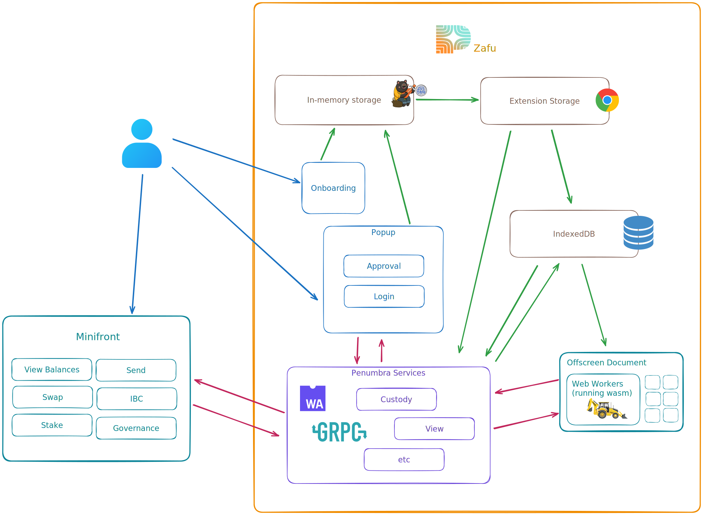

# Docs

For an overview of what Zafu is and how to install it, see the
[root README](../README.md).

## Common scripts

These scripts can be run from the repo root (where they use turbo for the
monorepo) or from inside an individual app or package directory (where
they only run for that one).

- `pnpm clean` - remove build outputs
- `pnpm compile` - compile rust into wasm
- `pnpm build` - transform and bundle all packages and apps
- `pnpm dev` - build all, serve local apps, watch and rebuild
- `pnpm test` - run vitest only (cargo tests are omitted)
- `pnpm test:rust` - run cargo tests only
- `pnpm format`, `pnpm lint`
- `pnpm all-check` - everything

## Subject documents

### Zafu-specific

- [Threat model](THREAT_MODEL.md)
- [Multisig](MULTISIG.md)
- [Multinetwork architecture](MULTINETWORK_ARCHITECTURE.md)
- [Memo protocol](memo-protocol.md)
- [Zigner-first architecture](ZIGNER_FIRST_ARCHITECTURE.md)
- [Custody](custody.md)
- [Deployment](deployment.md)

### Engineering practice

- [Guiding principles](guiding-principles.md)
  - [All code should be typesafe](guiding-principles.md#all-code-should-be-typesafe)
  - [CI/CD enforces best practices](guiding-principles.md#cicd-enforces-best-practices)
  - [Modularity from the beginning](guiding-principles.md#modularity-from-the-beginning)
  - [Ongoingly document](guiding-principles.md#ongoingly-document)
- [CI/CD guide](ci-cd.md)
- [Documenting changes](documenting-changes.md)
- [Dependency upgrades](dependency-upgrades.md)
- [Publishing](publishing.md)
- [State management](state-management.md)
- [UI library](ui-library.md)
- [Testing](testing.md)
- [Web workers](web-workers.md)
- [Protobufs](protobufs.md)
- [Extension services](extension-services.md)
- [Writing performant React components](writing-performant-react-components.md)
- [Debugging](debugging.md)

## Tools

- **pnpm** - package manager; the workspace feature is the foundation of
  the monorepo
- **turborepo** - parallelize script execution, manage execution
  dependency, cache outputs to accelerate execution
- **syncpack** - synchronize package dependencies, validate version
  ranges, format and lint package.json
- **changeset** - increment semver topologically and progressively
  compile release notes as PRs merge
- **webpack** - bundles the extension; vite is used for some packages
- **vitest** - testing framework, workspace-aware

## Architecture in one paragraph

Zafu is a Chrome MV3 extension. It manages keys (see
[custody](./custody.md)), persists chain state in `chrome.storage` and
IndexedDB, and runs heavy crypto in web workers (see
[web workers](./web-workers.md)). For Penumbra it queries a remote `pd`
endpoint to scan a compact representation of the chain. For Zcash it
queries [Zidecar](https://github.com/rotkonetworks/zidecar) for note
commitment trail and verifies all proofs locally before trusting any
returned state. The cold-signing companion is
[Zigner](https://github.com/rotkonetworks/zigner), an offline phone that
talks to Zafu only via QR codes.

<!-- This link is read-only. Update if you edit or replace the diagram.
https://excalidraw.com/#json=_3b4K0RpWFJWAtVCH5ymB,CHegLkto1X_NdKG67LNh2A
-->
